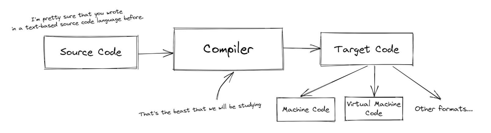
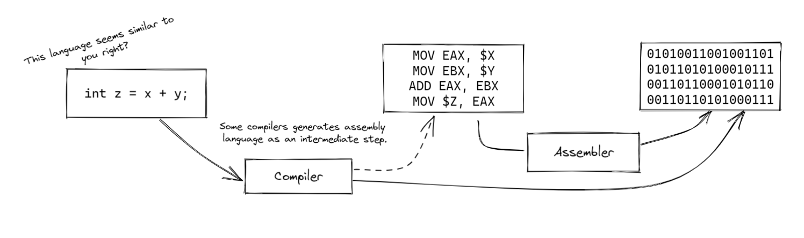
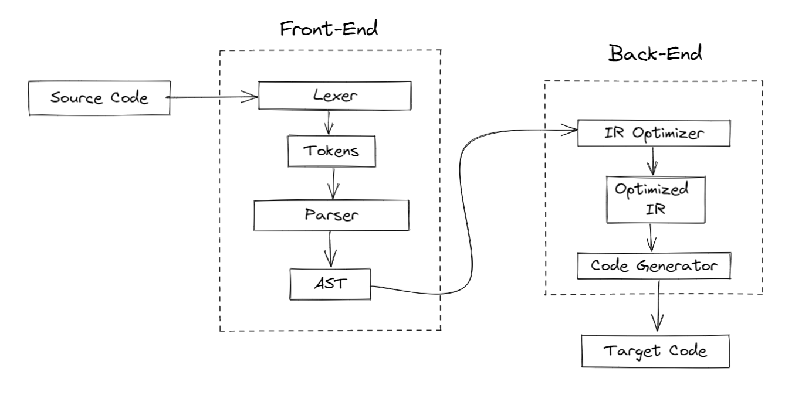

# Preface
When I started programming when I was 11 using VisualBasic.NET reading and going through the years with C#, C and C++ doing my hobby projects and started get fond of programming and curious about how specific products are made like browsers, operating systems and others but one of the applications I was always curious about was **Compilers**. These applications must be a magical creations created by those programming wizards, that's what I thought of them.  
In my first year at college I decided to learn compilers construction. Did my searches, started to get into the glorious Dragon Book[1] barely understood the first chapter, although the book wasn't that impossible but it was more like a textbook that needs a professor or someone to help me to get through it, So after reading the highly-recommended Crafting Interpreters[2] I had an overview and was able to get more deeply in the topic and reading more books and doing more compilers and interpreters in my free time as hobby.  
After writing my notes, I decided to write my own little book to be as a help for undergraduates and any one who is interested to learn the topic in a more straightforward way.

# About Authors
**TBD**

# Chapter 1: Introduction
## Why would I learn compilers construction
If you are a computer science student you are likely to have this course in one of your last semesters or you may be already a developer who's wondering why would I learn such a topic in both cases let me tell you why.  

**It's the time to know about the software you use the most**  
You use compilers/interpreters[n] everyday as a programmer, so understanding what happens behind the scenes will make you value these state-of-art applications and make you think of your code and programming languages that you use from another perspective since you become more aware of the philosophies and actually your close-to-English commands are translated to the computer.  

**A great thing to add to your software engineering toolbox**  
You don't have to be the next James Gosling (although we always need new langauges for the modern solutions) but there's no problem in writing a small hobby programming language which doing so will enrich your knowledge of many algorithms and design patterns because compilers are complicated projects made of integrated parts to do their tasks, from text parsing to code generation and optimization, many problems you will solve so it's going to help you in other non-programming-language-related projects.  

## What are compilers?
We can define a **compiler**: a program that translates a programming language (mainly called _source code_) to _target code_. Seems a simple and straight-forward, but to clarify:

**Source Code:** What compiler takes, a human-readable set of commands which is primilary a text like what you have written before like in C, Java, Haskell... but can be in other formats like MIT's Scratch[n] which is about visual blocks to build a programming logic

**Target Code** The compiler generates it, and the computer is meant to understand it. The target code is to a great degree is machine code that the computer understands natively but it can be in another formats that targetted machine will understand but not directly and that's will be discusssed later.

From here we can simply draw that as this:


## Machines and languages
### Languages
About the other formats of the target code we need to know two concepts: **Machine Langauge** *(or Native Code sometimes)* is the language that computers understands. a low-level instructions which the CPU executes to do specific tasks that controls the computer. It's represented in numerical form (mostly bunch of binary one and zeros) or bytes which makes it easier to the CPU to realize but makes it harder to humans to maintain or write in, and that's why humans made compilers.  
This takes us to a higher one in the level: **Assembly Languages** these languages are the more human-readable 1:1 representation of machine language, the computer doesn't understand it directly so it has to be translated using an *assembler*. The way it exposes the machine instructions makes it used in system programming and low-level applications that require a deep control of the computer, that's why they are not popular as they used in specific cases.  
Writing in assembly language isn't great too in terms of maintaining large projects so **High-Level Languages** comes to provide a more human-readable and more intuitive form of programming and these languages are translated by a *compiler*. High-level languages are like the ones you used before like Python, C, C++.. 
 

### Native Machines Langauges
Your processor has it's own language called machine language, which is mentioned in the previous section. We call languages that compiles into the machine language of a processor, a **native language** because they are translated into the instructions that the computer can directly understand. These languages execute faster because there is minimal overhead in execution since there is no intermediate medium between the source code and machine code. Once the source code is compiled, it can be run directly on the machine.

### Virtual Machines, and it's Languages
So you have created your own custom set of instructions as a series of bytes, each with its own meaning. To do this, you developed a compiler that translates your programming language into your new, sophisticated virtual machine code. However, because your processor does not recognize these bytes, you must write an interpreter that can execute these instructions. You may be wondering why this intermediate step is necessary, rather than simply compiling directly to native machine code. One drawback of executing native machine code directly is that the source code, or source language, will only run on the targeted machine architecture. For example, a machine language designed for x86 architecture (which is commonly found in laptops and PCs) will not run on a phone with an ARM architecture. A virtual machine provides a way to unify the generated byte code, making it possible to run the program on any architecture, so long as a translator is available to convert the bytes to the host format.
A virtual machine in programming languages is a software program that interprets or compiles code written in a specific language, providing a layer of abstraction between the code and the underlying hardware. This allows the code to be executed on different operating systems and hardware architectures without modification, making it more flexible and portable. Popular examples include the Java Virtual Machine (JVM) and Common Language Runtime (CLR) which is used for executing .NET langauges like C# and Visual Basic.
## Compilers vs. Interpreter
There are two main types of translations of programming languages:  
**Compiled Languages** are languages that are translated to target code (TBD..)


## Compiler Phases
The process of compilation can be a long journey but we will divide it into two parts.  
The **compiler front-end** focuses on the analysis of the source code, building an representation of it and checking for syntactic and semantic errors before going to the next part, **compiler back-end**, which focuses on optimizing the representation made by the previous part and generate the code that will be executed later.  

A compiler is a good example of integrated modules where every step can be represented of a module that takes an input from the previous step and produce an output that the next step will use.
We will get through these modules and implement them for our language in the next chapters.

## Language  Paradigms & Terminology

## petiteBASIC
Through this little book, we will implement our little programming language named petiteBASIC (*petite for little in french*). It's inspired by the honoured 60-year-old BASIC language and influenced by popular dialects like FreeBasic and sisters. The language is meant to be simple and be an application to what we will learn through the chapters.
Here are some sneak peaks of the syntax and main features for the hyping you, but you have to know that languages are not described by their features but with a notation that explains how grammar is checked and expressions are evaluated, and we will describe the language more formally in the next chapters.

```basic
' this is a comment

' Input/Output
print("Hello, World!") ' How could we even forget it!
num age = read()   'pBASIC is weak typed so str can be converted to num

' variable declaration
num myNum = 15 
str myName =  "john"


' Branching
if age > 18 then
    print("You are old enough")
else
    print("You need to wait " + (18 - age) + " years")
end if

' Loops
num n = 10
while n != 0
    print(n)
    n--
end while
```
> Code example for petiteBASIC