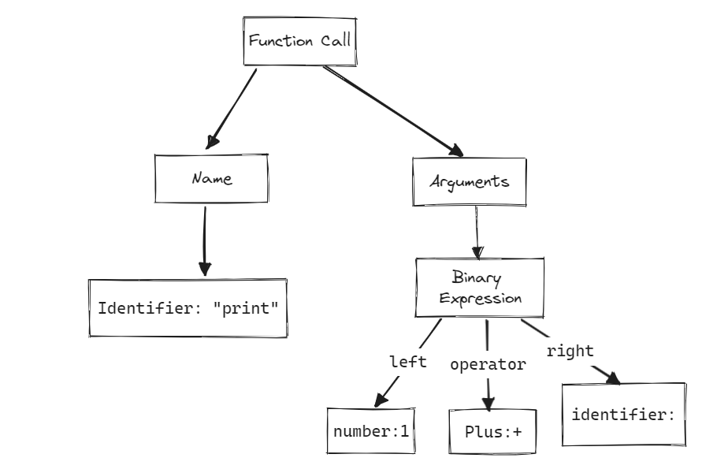
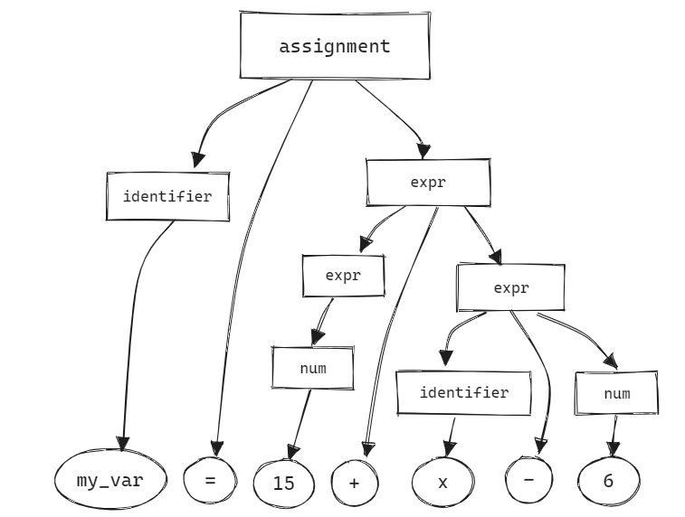
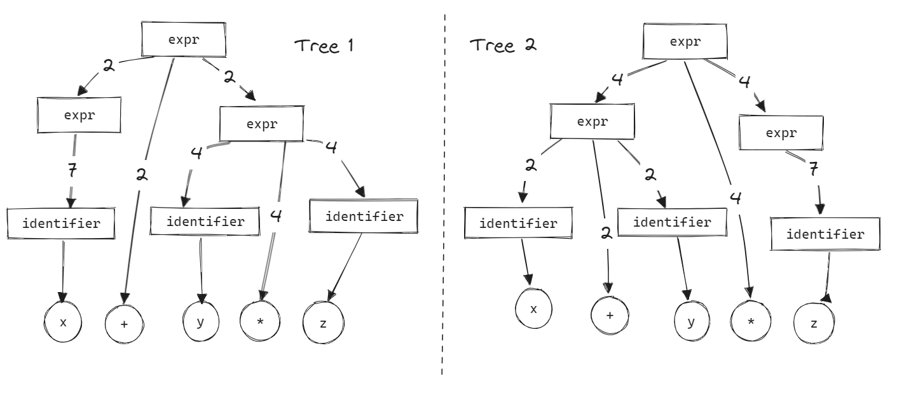

# Chapter 3: Parsing

We've seen in the last chapter how lexical analysis is an essential step to check if source code belongs to the lexical grammar and language of pBASIC and how our scanner generates the tokens and even reports lexical errors. There are limitations to the scanner and it's underlying grammar notation, like it can't check if the statement is correct syntatically according to pBASIC. `print)4+` or `while !x` are true lexically but wrong syntatically, so we need a higher grammar representation and another phase for our compiler, the parser

## What's Parsing
According to Merriam-Webster dictionary, the verb 'parse' is
> **parse** *verb*  
to divide (a sentence) into grammatical parts and identify the parts and their relations to each other  

Take the following line, as exmaple, it should print "Hello World" accoriding to pBASIC specification in Appendix 1. It's valid as syntax because the print function has it's enclosed parenthesis and arugments are valid expression, the binary operator 'plus' takes 2 operators, so it's all valid and legit from our view.
```basic
print(1 + x)
```
Our scanner will emit as tokens as following, converting the string of characters into a string of tokens.
```
[Identifier:print] [OpenParenthesis:(] [Number:1] [Plus:+] [Identifier:x] [CloseParenthesis:)]
```
Parser processes tokens, it works on tokens level, which is a higher level, it takes the fragments of source code and checks if it's syntatically correct. So *another correctness to be checked? so we need another grammar?* It seems you understood the game. We need a *grammar* that deals tokens, the higher representation, to reports errors and convert the tokens into a another format that represents the syntax, a.k.a **Abstract Syntax Trees**

## Abstract Syntax Trees
*Trees?* Yes, abstract syntax trees (AST) are graphical representation for syntatic form of source code as trees, so the previous code example `print(1 + x)` AST can look like the following figure. Considering it's roots and leaves, an AST ends with the tokens we got from our scanner, in the new representation that the parser generates, there's higher relation between the tokens. A Binary Expression node as example has 3 childs a left-hand leaf, operator leaf, and a right-hand leaf. And like the scanner's tokens which were used in our parser, these are used in further phases.


## Context-Free Grammars & Languages
In previous chapter we introduced regular grammars and took a brief of formal grammars. Here we present context-free grammar (CFG), a higher formal grammar for describing the syntax of our language. Regular grammars had limitations for our purposes, take an example the following popular grammar: We need to match enclosed parenthesis that each every opened parenthesis gets it's closed one, i.e: `(())` & `(()())` are valid but `)(` or `(()` are not. Try it yourself implementing a RegEx or sketching a finite automata for it, it's impossible because regular grammars don't store states, they are limited in memory.

```{seealso}
There are formal ways to check if a grammar can be regular or not read about Pumping Lemma.
```
This grammar is not regular and you can't represent it as any regular form, but it's context-free one. Here an example of a CFG for the previous problem  

1. ***S*** → `(`***S***`)`***S***  
2. ***S*** → ε

Let's dissect the previous CFG: Throught this textbook ***S*** or any ***bold-italic*** word represents a **variable** or a **non-terminal**, `)`or any `red-monospace` word represents a **terminal**. *I'm numbering the lines for referencing them later.*. small sigma (ε) represents a the empty character non-terminal. Each line in a CFG called a **production**:  
***variable*** → *sequence of `terminals` or **non-terminals***  
Productions by their name generates strings accepted by the grammar, the process of solving a one production is called **derivation**. Terminals don't produce anything and considered the last leaf in the AST as we will see (that's why it's caleld terminals).  
Returning back to balanced parenthesis example, let's derive production line (1) by replacing the non-terminals on the right by any of the production values of the selected non-terminal. using ⇒ to denote single derivation step.  
***S*** → `(`***S***`)`***S*** ⇒ `(`ε`)`***S*** ⇒ `()` `(`***S***`)`***S*** ⇒ `()` `(`ε`)`ε  
resulting `()()` which is a valid string to our CFG. Each derivation we substituted the non-terminals (in this CFG only ***S***) with any one of it's available productions 1. or 2. which is `(`***S***`)`***S***  or ε. a shorter version of that CFG could be represented as following, using `|` for "or" as another optional production.
***S*** → `(`***S***`)`***S*** | ε
Try yourself deriving by any order of production lines and you will generate valid strings according to our syntax. Remember that grammars as called generators!

  
Taking the outer leafs of the tree (circle nodes represents terminals/tokens) it ends with [`()()`], remember ε represents an empty character.  

You can note that working 
## Describing The Language
Context-free langauges is the formal language we use in parsers. Our snytax follows a grammar that we will express it formally like we did with lexical rules. **Metasyntax** notations describes structure and rules of syntaxes of languages like regex which expresses regular grammars. The most popular metasyntax notation for context-free grammars is **Backus-Noir Form (BNF)**. 
We will use BNF for formally defining pBASIC syntax structure. BNF is made of production lines which each line starts with a non-terminal followed by terminals or non-terminals specifying the structure. *Does it remind you of CFG?*. Here's an example of a BNF for a small english language.
```
SENTENCE := NOUN VERB
VERB := 
NOUN := "alice" | "bob"
```
Consider the following pBASIC snippet:
```vb
x = 3 + 4
```
It's an assignment statement! it follows the syntax: an identifier followed by a equal sign then an expression. Ooof, I hate verbal expression, here's the BNF:
```bnf
<assignment> := <identifier> "=" <expression>
<expression> := <num> "+" <num> | <num> "-" <num>
<identifier> := [A-Za-z_]+
<num>        := [0-9]+
```
> Grammar (a)

From the previous BNF, the `assignment` rule is what we described before, made of the `identifier` non-terminal followed by an equal sign and an `expression`. An `expression` non-terminal is defined to be either `num` "+" `num` or `num` "-" `num`. Note how optional productions using (`|`) operator. This BNF is not correct, because it only accepts `x = 8+6` but doesn't accept `x = x + 1` or `x = 1 + 2 + 3` so let's re-write the BNF with the new consideration. Let's support more arithmetic operators, adding multiplication and division our BNF for assignment will be:
```bnf
1. <assignment>    := <identifier> "=" <expr>
2. <expr>          := <expr> "+" <expr> 
3.                 | <expr> "-" <expr> 
4.                 | <expr> "*" <expr> 
5.                 | <expr> "/" <expr> 
6.                 | <num> 
7.                 | <identifier>
```
> Grammar (b)

Now, giving the code `my_var =  15 + x - 6`. It starts with an `identifier` so going with rule 1, it expects an `=` after it, that's true, then an `expr` is expected. `expr` is made of 4 optional production rules. Rule 4 and 5 are not the ones we are looking for because `15 + x - 6` is not a `num` or an `identifier`. It can be made of rule 2, because `15` is the right hand `expr` followed by a `+` then left hand `expr` is the rule 3 `x - 6` which can be derived into `<identifier> "-" <num>"`. The following AST will make it more clear:
  
*I love building syntax trees, it shows the power of formal languages.*  
Hold on! Why not going the opposite? choosing rule 3 first then rule 2, ending by deriving the rightmost `expr` first (`<expr> "-" "6"`) then going with rule 2 so it derives into `15 + x - 6`, ______ is called **associcativity** and it's our first concern of three concerns about our syntactic design.  
Let's derive it from the right and see what 


Since most of tricks is with `expr` part let's focus on the following expression `4 + 6 * 2 - 1` it yields 15, if you are good with primary math, you will know PEDMAS rule, which you will do multiplicaiton first. so you need a special order for deriving because all `expr` rules are optional, here comes the second concern **precedence** which governs such problems. Continuing on the previous CFG, the next code `x + y * z`, if you try to left-most derive it, it ends with 2 different parse trees:

In both tree 1 & 2, I added numbers on the arrows to denote which rules used in derivation. Both trees accept and represent the code correctly, *I don't see the problem*, but that's wrong, the parser job is accept the code if it follows the grammar and to generate ASTs, but generating different ASTs means using different rules with same input even if it matched the same rules, means the our grammar is **ambiguous**, because different rules means different views and code generations. that's the third concern of defining our grammar. Let's see focus on the three problems and how to solve them.

### Precedence
Operator precedence refers to the rules that dictate the order in which different operators and operands are evaluated in an expression. Operator precedence determines which operators are evaluated first when an expression contains multiple operators. For example, in the expression `2 + 3 * 4`, operator precedence dictates that multiplication (`*`) takes precedence over addition (`+`), so the expression is evaluated as `2 + (3 * 4)`, resulting in a value of 14.  
Operators are ranked in precedence, The operators with higher precedence are evaluated first, while those with lower precedence are evaluated later. For arithemetic expressions, parenthesis are highest precedence so that's why we use them for forcing order of evaluation. Multiple can share same precedence like (`*`) and (`/`), so `1 * 6 / 3` can be either evaluated as `(1 * 6) / 3` or `1 * (6 / 3)`.  
In *Grammar (b)*, We have to force an order for evaluating expressions, but `expr` is filled with optional derivations for expressions to fix this problem, Here's the modified Grammar (b) Let's understand it:
```bnf
1. <assignment>    := <identifier> "=" <expr>
2. <expr>          := <term> 
3.                  | <expr> "+" <term> 
4.                  | <expr> "-" <term>
5. <term>          := <factor> 
6.                  | <expr> "*" <factor> 
7.                  | <expr> "/" <factor> 
8. <factor>        := <num> 
9.                  | <identifier>
```
> Grammar (c)  

We've added productions: `<term>`, and `<factor>` making grammar is less loose now than before. Trying `3 + x * 8` as input...

### Associativity

### Ambiguity

```{important}
**Statements vs Expression**
```
## Recrusive Descent

## Writing The Parser
Remember that our parser's job is to take the tokens stream and generates the syntax tree and validates if it obeys our grammar rules. 
## Compiler Compilers
## After words
