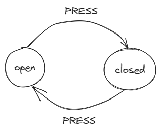
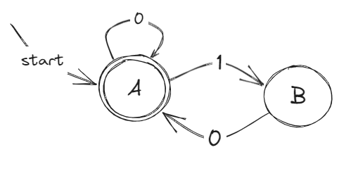
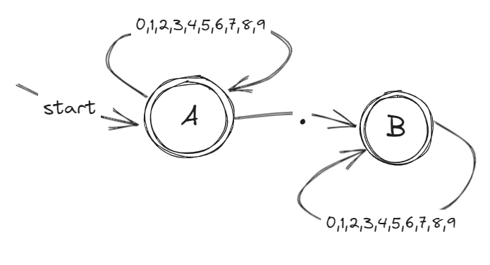
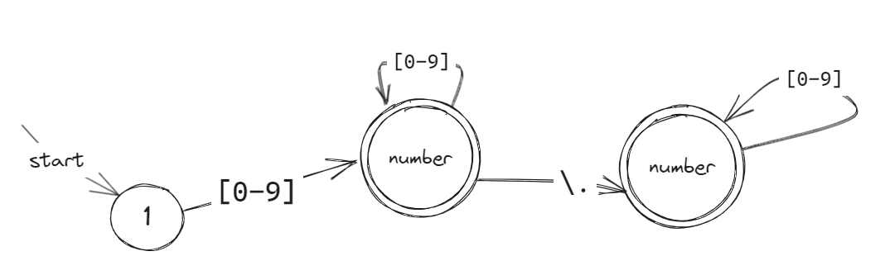
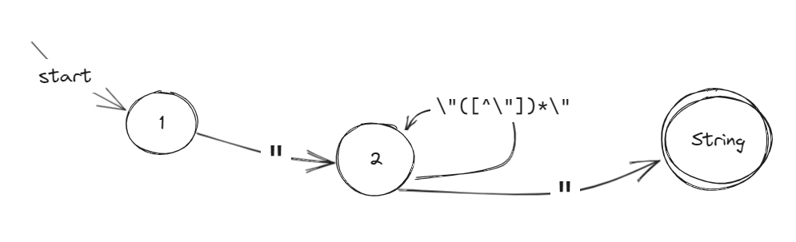
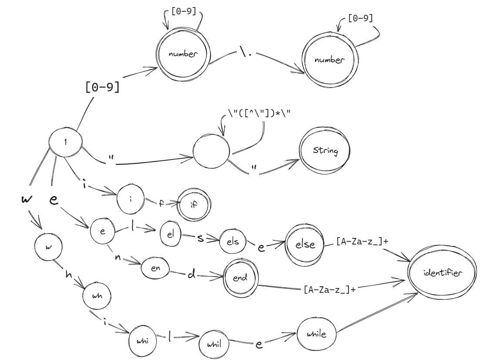
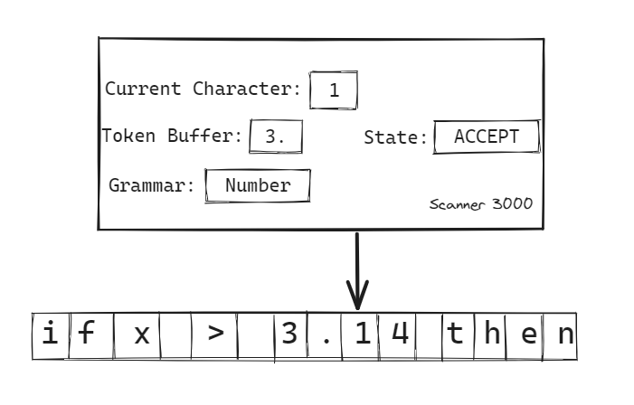

# Chapter 2: Scanning

## What's Scanning?

*Woah, it's getting hot! So much information is filling up my head!* Don't panic, it's just a long journey, but we will take it step by step. Let's start with our first step in building our compiler, which is scanning. But first, let's see source code from our human perspective. Take a line from our previous example:

```basic
num number_variable = 15
```

Knowing from Appendix A1, this line declares a variable called `number_variable` of type `num` and initializes it with the value 15. That's called the semantic of that statement, which refers to the meaning and interpretation of the code. Let's take a step back. When you first saw the structure of the line, your mind went, "Okay, we start our statement with the keyword `num`, then another word `number_variable` (which is not a keyword), then an equal sign, and a number which is 15." You broke down the code statement into units *(Yes, you thought of that, I hope)*, which you used to build that statement. And since you know the syntax of pBASIC, you know that this is the syntax for declaring a variable, based on the breakdown of the code statement. Such a way of thinking is easier for us as humans, but it's complicated to implement on computers. We call that an abstraction... *What?*

To clarify things, what's a suitable type for dealing with source code? A `string`, right? A string just provides us with the characters of the text string (`n`, `u`, `m`, *`SPACE`*, `n`, `u`, `m`, `b`, `e`, `r`, `_`, ...). They are simple units too, but that representation is too granular. You want to work with more meaningful units as you move into the next phases. So, grouping these characters into bigger units will help us process the source code text. The scanner generates **lexemes** like: [`num`], [`number_variable`], [`=`], [`15`], representing the word units of the statement code.

## Tokens
These lexemes can be assigned with attributes to describe it's meaning or type, combined together, resulting a Token. Consider the following statement in C as example:
```c
a = x + 10;
```
A C tokenizer *(another name for scanners)* would generate tokens: ([`a`], [`identifier`]) ([`=`], [`equal`]) ([`x`], [`identifier`]) ([`10`], [`number`]). A token consists of:
* A lexeme (eg. `10`), a string value of the part of text.
* A type (`number`), the class of which the lexeme belongs to, examples:
    * Keywords: reversed keywords in the language
    * Identifiers: symbols like function names, variable names, class names etc..
    * Literals: 
        * Including different number norations like hexdecimal `0x12` or binary `101010101b` or float `5.89f`.
        * Strings: `"Some string!"`

Other attributes like the position and line of the token is helpful for reporting lexical errors.
Inability to detect a token or violating a **lexical rule** should be reported as an **lexical error** and halting the process of scanning.

> Lexical Errors:
> Todo: Power of Abstraction!

```{note}
The word 'lex' comes from greek word 'λέξις' *(lexis)* meaning 'word'. So slicing the strings into lexemes would mean slicing them into words but a word in programming has different meaning than the intuitive one. The string ``print("I like compilers!")`` when it comes to our lexer, [`I`] [`like`] [`compilers`] are not words or lexemes for sure! but will produces [`print`] [`(`] [`"I like compilers!"`] [`)`] instead, denoting the them as the little pieces that build our language statement. We will deal with many  
```

```{admonition} Definition
**Scanning** *or* **Tokenization** *or* **Lexical Analysis** is the process of breaking down source code and classifying segments of the string into more meaningful tokens from raw string format for processing these tokens for further processing.
```

## Regular Languages and Expressions
We mentioned that the scanner's job is to tokenize the input string and to check whether a lexical word belongs to one of our **lexical rules**. So we can consider the scanner as a **machine** and the rules are the **grammar** of our language, a theortical machine that deals with our strings as inputs and checks if they are grammarly correct. Let's get with  a bit of computer science wih Automata & Langauges theory! Automata theory is the study of abstract machines and their computational abilities. It analyzes formal languages and classifies them based on the computational models needed to recognize or generate them. It has applications in areas such as compiler design and natural language processing.
A finite automaton has
### Finite Automata
We start with the simplest computer machine model called **finite automaton** or **finite state machine (FSM)**. These computer models are abstract which means we are not going to build it in the physical world, just on paper, describing it's functionality: Detecting patterns from set of inputs, *in our compiler construction journey it's the characters set*. These models limitations which a higher level of models can overcome them in the next chapters.  
Consider the following figure of a simple FSM of a door with a button, so we can extract the main characharistics of such machines and describe how it works:  
  
A finite automaton has:
* finite set of states : {`open`, `closed`}
* set of inputs (alphabet) that transfer from a state to another: {`PRESS`}

The door has a button, it understand only one input (a press) that control it's state. Pressing the button while it's closed will make it open and vice versa. The set of valid inputs are just pressing the button, *Is there something else?* The set of a machine inputs called **alphabet**  of the language. A language has alphabet and rules of inputs inserted to the machine.
A finite automoton has also optional **final (accepting) states** which denote the last step or halting the machine.  

#### Finite Automata Example
The following finite automata *accepts* whose **grammar** is "Accept a binary string if and only if it ends with zeroes". A double circled state means it's the final state means if the last character in the string lead you to `A` the string belongs to this machine language and machine accepts and recognizes it.  
  
This machine accepts strings `010` and `100`,... but strings `0111` and `11001` won't pass, you can try and by your fingers over the figure. You can *generate* infinite set of strings that our machine can accept, that's called the **langauge**, that's why a grammar is called a **generator** and machine model called **acceptors**.  
According to the figure, the machine has the following charasterics and make more terminology.
* **Alphabet**: {`0`,`1`}
* **Grammar**: "A binary string ending by zero"
* **Language**: {`0`, `00`, `000`, `10`, `1100`, `010`, `01110`, `00001100`,...}

```{admonition} Automata Terminology
Listing the important terminologies we learnt for automata theory:
* **Machine**: Abstract computational model.
* **Alphabet**: Possible input character set.
* **String**: Sequence of alphabet characters.
* **Grammar**: The rule that machine recognizes/accepts the input string based on it and determine the language.
* **Language**: Set of strings that machine accepts (applies the grammar).
```

```{note}
Since this is not an automata theory book, I only covered the basics that we will need in our journey. you can extend your knowledge of this interesting field by reading further topics like: Deterministic & Non-Determinstic Finite Automata, Pumping Lemma, Grammars, Language Hierarchies, Closures...
```
### Grammar
A scanner should be able to detect token type (class) from string input, as example: ``_pi = 3.14`` would produce the tokens [`_pi`,`identifier`] [`=`,`equal`] [`3.14`,`number`]. For the first token classified as `identifier`, we can define it's rule as "Sequence of alphabetical letters that can contain underscore". The third and the most interesting token has the type `number` and there's a rule that our hypothetical scanner follows to detect the token from a string. We could say the rule (according to pBASIC **syntax**) that a `number` is "Sequence of digits that optionally contains a dot", so `8502` is a valid number but neither `17.69.3` nor `12.` nor `6..9` are valid numbers. Let's sketch a FA that accepts this grammar:   
It's verbose to describe our lexical rules in English statements, although we learnt a formal way for describing regular grammars which is finite automata but drawing graphs for simple grammar still cumbersome, imagine doing the FA for identifier rule, 26+ characters on one arrow!. We need a more concise and more formal way, and here comes **Regular Expressions**.

### Regular Expressions
When it comes to describing regular langauges, regular expressions (Regex for short) is more concise to use. Regex is widely used in text processors for string searching algorithms and to detect and match patterns in sequence of characters (string) and that's what we need for our scanner to check whether the string matches our rules therfore it's lexically correct!  
Regular Expressions are algebric notation that has it's own formal rules to describe the our patterns. 
We will see that regular expressions are easy to type, and they tend to use relatively short descriptions for common languages that we want to represent. Of course, even a relatively small and precise specification for a language can be hard to come up with (or to understand). But at least with a regular expression, it is usually quick and easy to type once you have it.


## Writing The Scanner
Let's start crafting our scanner, the first cornerstone of our compiler. First, We start with lexer class:
```csharp

using System;
using System.Collections.Generic;
using System.Linq;
using System.Text;
using System.Threading.Tasks;

namespace pBASICCompiler
{
    public class Lexer
    {
        // This will contain full source code
        string _source;

        public Lexer(string sourceCode)
        {
            _source = sourceCode;
        }
    }
```
> **Lexer.cs**

The `lexer` class constructor takes the full source code, as you see in Main

```csharp
using System;
using System.Collections.Generic;
using System.Linq;
using System.Text;
using System.Threading.Tasks;

namespace pBASICCompiler
{
    public class Program
    {
        public static void Main(string[] args)
        {
            string source_text = File.ReadAllText("source.pb");

            Lexer lexer = new Lexer(source_text);
        }
    }
}
```
> Program.cs

We store the file content that contains the source in `source_text`, the path we pass to the `lexer` constructor. The purpose of `lexer` class is to scan and get the tokens to use in the parsing phase (next chapter), so we start we need a class that encapsulates tokens.

```csharp
public class Token
{
    public TokenType Type { get; }
    public string Value { get; }
    public Token(TokenType type, string value)
    {
        Type = type;
        Value = value;
    }
}
```
We mentioned that a token has a type and a string segment, which are represented as `Type` and `Value` properties respectively. `TokenType` is an enum for our token types.

```csharp
public enum TokenType
{
    // Name             // (Example) Value
    None,
    Identifier,         // my_var
    Number,             // 3.14
    Equal,              // =
    NotEqual,           // !=
    Greater,            // >
    GreaterOrEqual,     // >=
    Smaller,            // <
    SmallerOrEqual,     // <=
    SingleQuotation,    // '
    DoubleQuotation,    // "
    OpenParenthesis,    // (
    CloseParenthesis,   // )
    String,             // "Hello World"
    Plus,               // +
    Minus,              // -
    Asterisk,           // *
    Slash,              // /
    DoubleEqual,        // ==
    DoublePlus,         // ++
    DoubleMinus,        // --
    DoubleAsterisk,     // **
    DoubleSlash,        // //
    Bang,               // !
    And,                // &
    Or,                 // |
    If,                 // if
    Then,               // then
    Else,               // else
    End,                // end
    While,              // while
}
```
> **Lexer.cs**

We need the tokenizing logic, a function that will process the source code and generates the tokens for us, we do ``Tokenize`` function that returns an array of `Token`s
```csharp
public Token[] Tokenize()
{
    // List of tokens to return
    var tokens = new List<Token>();

    // We will need to keep track of source code lines for reporting errors
    int line = 1;

    // 'pos' is the current position of the character, we will iterate over every character
    // and applying the lexical rule according to the our grammar
    for (int pos = 0; pos < _source.Length; pos++)
    {
        // For a little test, this will print every character in the source code surrounded
        // by square brackets, this will give you a better view of what strings and what
        // and what results we want.
        Console.Write("[" + _source[pos] + "]");
    }

    return tokens.ToArray();
}
```
Try it with a sample source code, it will print every character, this is a good start for now, iterating over every character because the character controls the analysis as we will see.  
As `Tokenize()` returns an array of tokens, we will print it outside in `Program.cs`'s `Main()`
```csharp
public static void Main(string[] args)
{
    string source_text = File.ReadAllText("source.vb");

    // Create new instance of Lexer class
    Lexer lexer = new Lexer(source_text);
    // Scan the given source code in consturctor, and return the tokens.
    var tokens = lexer.Tokenize();

    // Iterate over each token in the tokens to print them
    foreach(var token in tokens)
    {
        // Print the tokens format as [type:value], i.e [number:40]
        Console.Write($"[{token.Type}:{token.Value}] ");
    }
}
```
### Numbers
To make our scanner recognize numbers, we need to specify the grammar of numbers. We mentioned numbers grammar as a "Sequence of digits that optionally contains a dot" but still not clear description so we use regular expressions so it will be `[0-9]+\.[0-9]*`. (return to Regular Expression section if you didn't understand it). Sketching the finite automata will get us the following:
  
We need to implement the RegEx/FA into code. We know that regular grammar is for character-level, so we iterat
```csharp
public Token[] Tokenize()
{
    // List of tokens to return
    var tokens = new List<Token>();

    // We will need to keep track of source code lines for reporting errors
    int line = 1;

    // 'pos' is the current position of the character, we will iterate over every character
    // and applying the lexical rule according to the our grammar
    for (int pos = 0; pos < _source.Length; pos++)
    {
        // We start by checking if the character is a number regex: 0-9
        if (char.IsDigit(_source[pos])){
            // This will track if a dot existed.
            bool dot = false;
            // We will build the number string, intialized by the current character
            string number_string = _source[pos].ToString();
            // Increase the character pointer since we read it.
            pos++;

            // While we are not pointing at the last character and the current char is a digit or a dot,
            // we are safe, keep processing the number
            while(pos < _source.Length && (char.IsDigit(_source[pos]) || _source[pos] == '.'))
            {
                // If the current chracter is a dot
                if (_source[pos] == '.')
                {
                    // Check if we already read a dot before
                    if (dot){
                        // Report the error
                        Console.WriteLine($"Illegal Number at line{line} @ {pos} char {_source[pos]})");

                        // That source code has an issue, returns with the tokens we have, stop processing!
                        return tokens.ToArray();
                    }
                    else{
                        // Okay, so the next time, don't read a dot again!
                        dot = true;
                    }
                }

                // Append the current character to the string of numbers
                number_string += _source[pos];

                // Increase the character pointer since we read it.
                pos++;         
            }

            // We are outside the loop, that means the condition is bypassed. No we a have  a number
            // string stored in number_string. We add the recognized token to our tokens list.
            tokens.Add(new Token(TokenType.Number, number));
        }
    }

    return tokens.ToArray();
}

```
> **Lexer.cs**: `Lexer` class

Why not using a `double` instead of `string` for `number_string`? We will use `Convert.ToDouble()` method later, this will save us the need to implement our `string` to `double` converting algorithm.
Read the code well, understand the comments, and compare the code logic to the finite automata above this will integrate all the knowledge.

Try now runnning the application with various source code inputs of numbers and enjoy.
Trying the following source code,
```
12 4 6.7 4856.12 1..5 5
```
outputs:
```
Illegal Number at line 1 @ 19 char (.)
[Number:12] [Number:4] [Number:6.7] [Number:4856.12]
```
Yay! We made our scanner can recognize number, celebrate this! See how it groups it now as units and it can report the fragments that disobeyed our grammar and stopped the porcessing. Now we will continue recogizing other fragments that belongs to our language.

### Special Characters
There are special characters that are tokens as itself like `(` and `+` that will effect in the parser grammar and others that we don't care of recognizing them as tokens sometimes in our language but it effects the lexer state like `\n` (New Line) helps in tracking which line we are at now. Their grammar is easier to process, but I prefered to start with number processing because it's harder and gives a general view.  
They act only as one character so it's RegEx is the character itself, and no need to sketch the finite automata for it because it's simple. So back to our `Tokenize()` function, implemnting them is so intutive:
```csharp
            tokens.Add(new Token(TokenType.Number, number));
        }
    } // End of number's if condition
    else
    {
         // Switch over the current character
        switch (_source[pos])
        {
             // It's a new line? increase the line counter, easy?
            case '\n': line++; break;

            // A single quotation means it's a comment so keep skipping characters till the end of the line
            case '\'': while (_source[pos] != '\n') pos++; break;

            // For greater sign, stuff gets a bit complicated
            case '>':
                // If the next character is an equal sign...
                if (_source[pos + 1] == '=')
                {
                    // ... add a (>=) token to the list
                    tokens.Add(new Token(TokenType.GreaterOrEqual, ">="));
                    // move to the next character because we read the equal sign
                    pos++;
                }
                else
                    // otherwise, it's only a greater than token.
                    tokens.Add(new Token(TokenType.Greater, ">")); 
                break;

            case '<':   // The same logic here...
                if (_source[pos + 1] == '=')
                {
                    tokens.Add(new Token(TokenType.SmallerOrEqual, "<="));
                    pos++;
                }
                else
                    tokens.Add(new Token(TokenType.Smaller, "<"));
                break;

            case '=': // ...and here...
                if (_source[pos + 1] == '=')
                {
                    tokens.Add(new Token(TokenType.DoubleEqual, "=="));
                    pos++;
                }
                else
                    tokens.Add(new Token(TokenType.Equal, "="));
                break;

            case '!': // ...and here too.
                if (_source[pos + 1] == '=')
                {
                    tokens.Add(new Token(TokenType.NotEqual, "!="));
                    pos++;
                }
                else
                    tokens.Add(new Token(TokenType.Bang, "!"));
                break;

            // For the rest of single characters, just if it's the character in case
            // add it's token, very simple.
            case '+': tokens.Add(new Token(TokenType.Plus, "+")); break;
            case '-': tokens.Add(new Token(TokenType.Minus, "-")); break;
            case '*': tokens.Add(new Token(TokenType.Asterisk, "*")); break;
            case '/': tokens.Add(new Token(TokenType.Slash, "/")); break;

            case '&': tokens.Add(new Token(TokenType.And, "&")); break;
            case '|': tokens.Add(new Token(TokenType.Or, "|")); break;

            case '(': tokens.Add(new Token(TokenType.OpenParenthesis, "(")); break;
            case ')': tokens.Add(new Token(TokenType.CloseParenthesis, ")")); break;

        }
    }
    return tokens.ToArray();
}
```
That's it, now let's try it as usual.
Input:
```
12+3 !=4
```
Lexer output:
```
[Number:12] [Plus:+] [Number:3] [NotEqual:!=] [Number:4]
```
Everything seems to work correctly, now time for the next step.
```{note}
You saw that we ignored the single quote (') character as a token, because comments don't do such effect in the code logic but, it's still useful to consider it as a token for further processing. Some IDEs use the comments for generating code documentations like javaDoc or just showing a specific function description when hovering as example.
```

### Strings
Here comes another partition in our tokens, Strings, Which is made of any sequence of characters starting and ending by a double quotation, Hold on you forgot that we can't accept new line character is one of the enclosed character, so it's a constraint that we have to care about. It's RegEx is `\"([^\"])*\"`, *I love RegEx so expressive and short!*. Now let's draw it's FA:

Implementing it in code can be easy and intutive:
```csharp
        tokens.Add(new Token(TokenType.Number, number));
    }
    else if(_source[pos] == '\"')       // Strings
    {
        // We store our string value here
        string string_token = "";
        // Move to the next character, skipping the double quotation (")
        pos++;

        // While we didn't encounter another double quotation
        while(_source[pos] != '\"')
        {
            // Append the current character to the string token
            string_token += _source[pos];

            // If the current token is a new line, and we didn't reach to the closing 
            // double quotaiton mark then something is wrong, the string is not legal.
            if (_source[pos] == '\n'){
                Console.WriteLine($"Unclosed string at line{line} @ {pos} char {_source[pos]})");
            }

            // Increase the position pointer to next one.
            pos++;
        }

        // Add the string token to the token list.
        tokens.Add(new Token(TokenType.String, string_token));
    } 
```
Testing time!
Input:
```
15 * "test"
```
Output:
```
[Number:15] [Asterisk:*] [String:test]
```
Look how our scanner is growing!

### Keywords and Identifiers
Here comes the last part of our scanner. It's purpose to recognize identifiers and keywords. **Identifiers** are names of different symbols like variables, functions, and classes (but pBASIC doesn't have classes). The rule of naming symbols or grammar of identifiers according to our language is any sequence of letters or underscores: (`_pi`, `my_var`, `age`) and it's RegEx is `[A-Za-z_]+`. **Keywords*** are special fragments that has special effect on code logic like `if` it's used in if statements for implementing branches or `while` for the loop structure "while statements". When it comes for keywords grammar it's almost the same as identifier, it belongs to it's gramamr, `if` is belongs to `[A-Za-z_]+` so in our code implementation or FA graph we should handle keywords in a special way. Consider thefollowing FA:
  
In this FA, We handle the special keywords first by checking if it ends on one of they keywords we know and if still there are more characters then for sure it's an identifer, `if` is a keyowrd `ife` is an identifier. Implementing it in code is easy too, the FA seems tricky but in code it's easier.
```csharp
        tokens.Add(new Token(TokenType.String, string_token));
    } 
    // If the current character is a letter or it's underscore (_)
    else if(char.IsLetter(_source[pos]) || _source[pos] == '_') 
    {
        // We store our identifier/keyword value here
        string identifier = "";
        
        // while the position pointer is not past the length of the source code, and the 
        // current character is a letter or an underscore, complete processing...
        while(pos < _source.Length && (char.IsLetter(_source[pos]) || _source[pos] == '_'))
        {
            // Concatenate the accepted characters
            identifier += _source[pos];
            // Move to the next character
            pos++;
        }
        // Because the outer for loop already does a pos++ so it will skip
        // another character causing the same problem of numbers, so we decreament the
        // position pointer
        pos--;

        // Now we collected the characters, let's check if it belongs to our keywords set
        // by checking if that string exists in our map
        if(_keywords.ContainsKey(identifier))
            // Add it to our tokens according to the mapped token type
            tokens.Add(new Token(_keywords[identifier], identifier));
        else
            // Otherwise it's an identifier, so add it as an identifer token 
            tokens.Add(new Token(TokenType.Identifier, identifier));
    }
```
Here comes my favorite part, as we covered all the lexical fragments of pBASIC language let's try the source code with a bigger snippet
Input:
```
print("hello world")

if 4 > 3 then
	exit()
end if
```
and it outputs:
```
[Identifier:print] [OpenParenthesis:(] [String:hello world] [CloseParenthesis:)] [If:if] [Number:4] [Greater:>] [Number:3] [Then:then] [Identifier:exit] [OpenParenthesis:(] [CloseParenthesis:)] [End:end] [If:if]
```
Awesome, our scanner is done and it spits all the tokens to us and can even report the problems, you should be proud of this!  
If you combined all the FAs we showed you in a single unit (except special characters) that represents the full finite machine that models our scanner you will get this:

Woah!, seperating them was a good idea for real!
## Afterwords
You've made your scanner now and it's alive and breathing. We went through the foundations of lexical analysis and understood what is happening behind the scenes. We covered the topics of automatas and abstract machines *Your scanner if it was a machine it will look like this*:  
  
But what now? you may notice something, the scanner is doing a good job at generating the tokens and reporting the errors, but regarding the errors, `print)4+` is a valid according to the lexical terms and grammars, but for our language it's completely erroreous! also we  Now we need to process these tokens to follow *a higher grammar* that's on the token and syntax level, and that's what the next chapter will about, **Parsing**.